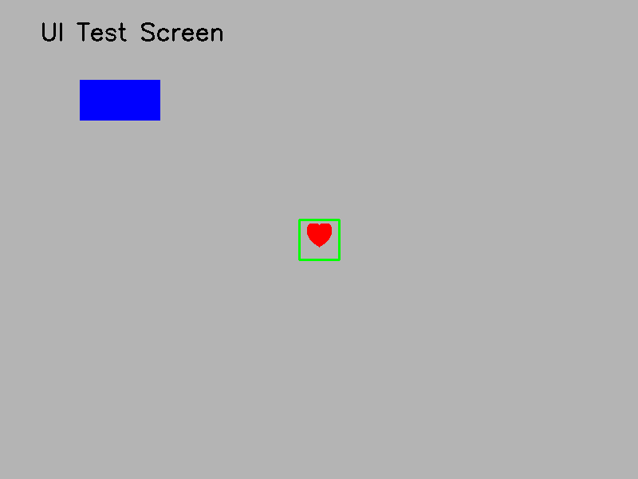

# # Project Tapper (PC & Mobile Automation PoC)

[Switch to English Version](#english) / [日本語版はこちら](#japanese)

👉 **Jump to:** [📊 日本語検証レポート](#jp-report) / [📊 English Research Report](#en-report)

---
<a id="japanese"></a>
## 📖 Project Tapper (PC & Mobile Automation PoC) - 日本語

OpenCVの画像認識と、人間の操作特性（ゆらぎ）を再現したアルゴリズムを組み合わせた、高精度UI自動化システムの概念実証（PoC）リポジトリです。

##  動作デモ（UI検知結果）
プログラムを実行すると、画面内のターゲット（赤いハート）を正確にロックオンし、緑色の枠線で視覚化します。



##  概要
本プロジェクトは、従来の「座標固定」「機械的一定周期」の自動化が抱える課題（解像度変更によるズレ、単調リズムによるシステムエラー）を解決するための検証コードです。
実業務や特定製品のコードは一切含まれておらず、ポートフォリオ用の汎用的なロジックのみを実装しています。

## 主な機能と技術的アプローチ
- **堅牢なUI検知（OpenCV / NumPy）**: 画面全体のテンプレートマッチングにより、ボタンの形状や色を正確に検出。
- **人間的なリズムゆらぎ**: 実験データに基づいた「ランダムな時間ゆらぎ（±0.2秒）」と「座標の微小なゆらぎ」を再現。
- **堅牢なエラーハンドリング**: 対象が見つからない場合の再試行（リトライ）ロジックを搭載。
- **環境シミュレーション（低バッテリーモード）**: デバイスの高負荷や低電圧時に発生する「フレーム遅延」や「認識精度の低下」を擬似的に再現し、過酷な環境下でのシステムの堅牢性を検証可能。

##  セットアップと実行方法
外部画像を用意することなく、以下の手順だけで手軽にローカルテストが可能です。

### 1. 依存ライブラリのインストール
```bash
pip install opencv-python numpy pyautogui
```

### 2. テスト用ダミー画像の自動生成
```bash
python create_dummy_assets.py
```

### 3. 通常デモの実行（自動検知＆ポップアップ表示）
```bash
python ui_tapper_poc.py -t heart_red.png --mock-screen mock_screen.png
```

### 4. 低バッテリー（高負荷環境）のシミュレーション実行
```bash
python ui_tapper_poc.py -t heart_red.png --mock-screen mock_screen.png --sim-low-battery
```

##  動作環境
- Python 3.x
- Windows / macOS / Linux

## 免責事項 (Disclaimer)
本リポジトリは、自動化アルゴリズムの研究および概念実証を目的としたオープンソースコードです。不正なアクセスや規約に違反するスクレイピング等を助長するものではありません。

---

<a id="english"></a>）
## Project Tapper (PC & Mobile Automation PoC) - English

This repository is a Proof of Concept (PoC) for a high-precision UI automation system that combines OpenCV image recognition with human-like behavioral ripples (timing fluctuations).

###  UI Detection Demo
When the program runs, it locks onto the target (red heart) on the screen and visualizes it with a green bounding box.

###  Overview
This project validates solutions for common issues in traditional automation, such as resolution mismatches and rigid click intervals. It contains only generic logic built for a portfolio, with no actual business or product code.

### Key Features
- **Robust UI Detection (OpenCV / NumPy)**: Accurately detects buttons via template matching.
- **Human-like Timing Fluctuations**: Simulates natural random delays ($\pm0.2$ seconds) and minor coordinate shifts.
- **Robust Error Handling**: Built-in retry logic when target UIs are missing.
- **Low-Battery Simulation**: Simulates frame drops and reduced accuracy under high device load to test system resilience.

### Setup & Execution
```bash
pip install opencv-python numpy pyautogui
python create_dummy_assets.py
python ui_tapper_poc.py -t heart_red.png --mock-screen mock_screen.png

